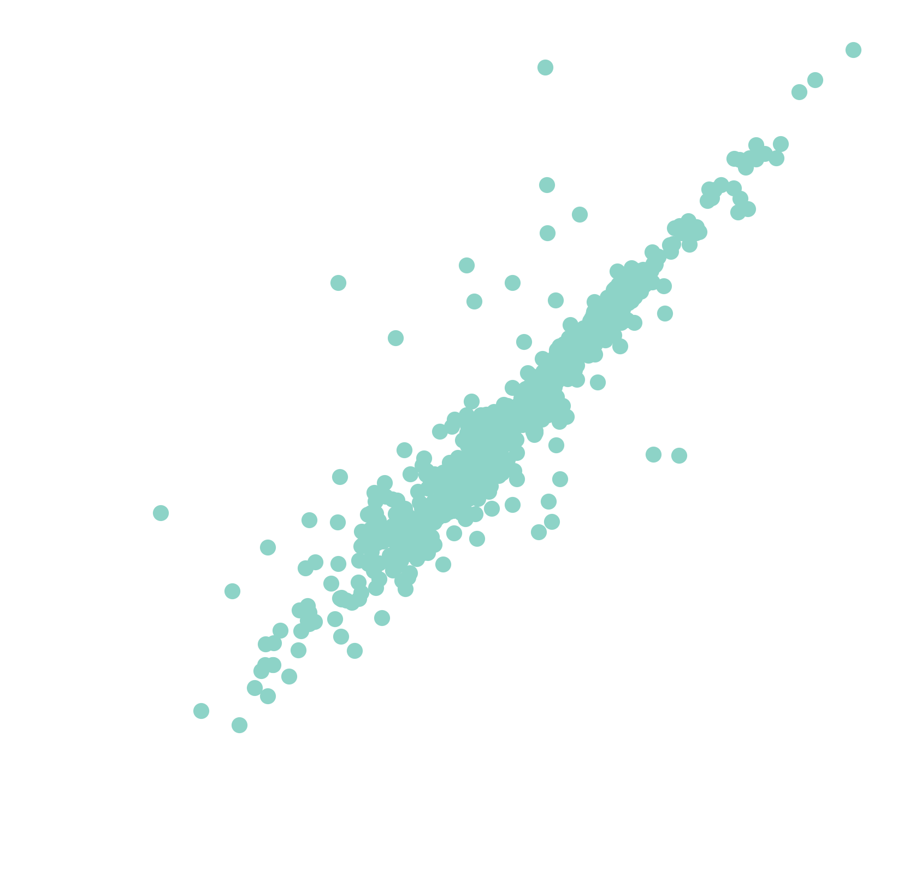
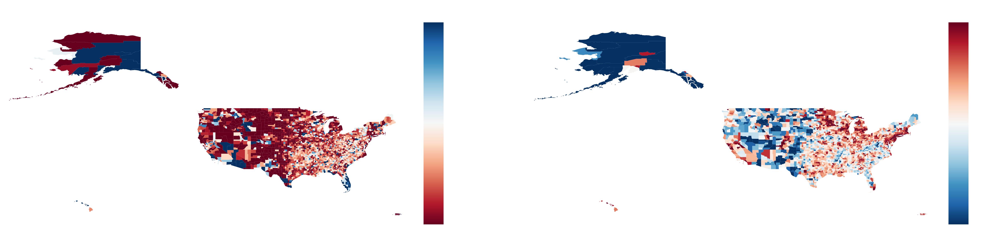
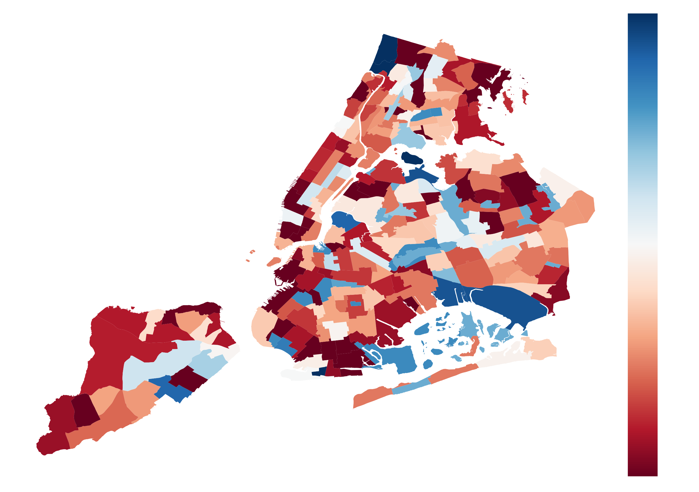
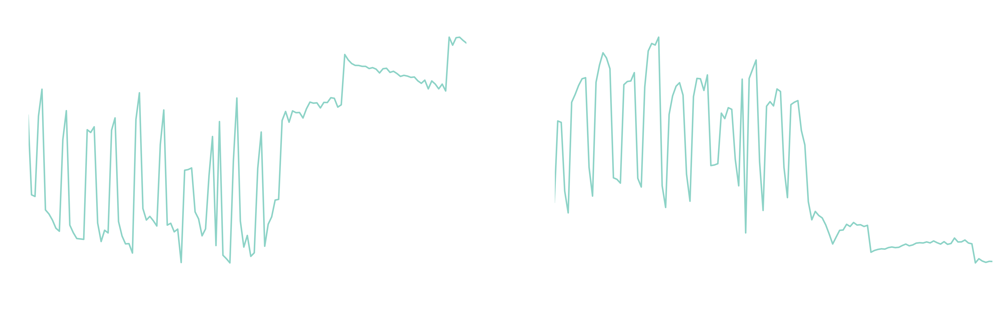
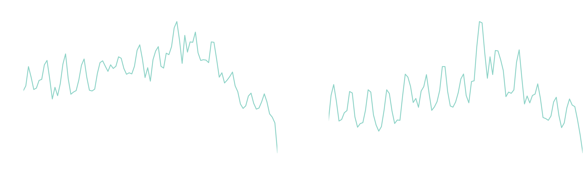
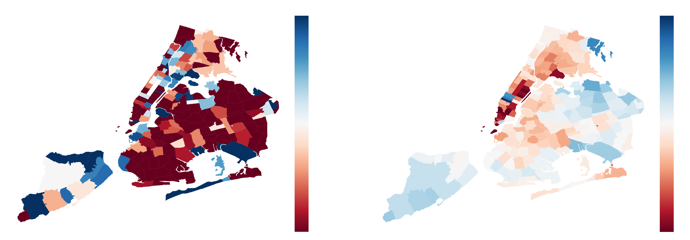

# Mobility patterns and expenditure behavior in the US during the COVID-19 outbreak

**Emanuele Massaro**

***École Polytechnique Fédérale de Lausanne*

***The World Bank Group* 

***Massachusetts Institute of Technology*

*Notice 1: this is preliminary analysis, has not yet been peer-reviewed and is updated daily as new data becomes available. This work is licensed under a Creative Commons Attribution 4.0 International License.*     

*Notice 2: This is preliminary work has not been shared yet with the public audiance. It serves as proof of concept for the AXA Research Fund – Call for Proposals Covid-19.*

*Notice 3: The same mobility analysis showed here for the US can be done for the different countries listed in the proposal.*

*Notice 4: The expenditure data analysis can be at this stage for the US and Mexico.*

## Data

Mobility data is provided by Unacast INC., a location intelligence, and measurement platform.  Expenditure data is given by Safegraph Inc.
This first-party data is collected from anonymized users who have opted-in to provide access to their location data anonymously, through a GDPR-compliant framework.

Location is collected anonymously from opted in users through smartphone applications. 
At the device level, iOS and Android operating systems combine various location data sources (e.g. GPS, wifi, beacons, network) and provide geographical coordinates with a given level of accuracy. 
Location accuracy is determined by the device and is variable, but can be as accurate as 10 meters.

Temporal sampling of anonymized users’ location is also variable and dependent on app/OS characteristics and on user behavioral patterns, but it has a high-frequency overall. 
We selected a panel of users who were active during the period January 1st - May 6th 2020. This leads to a sample of about 17Million users with a total of about 175 billion data points over the period of study. 
The basic unit of information we process is an event of the form (anonymous hashed user id, time, latitude, longitude), plus additional non-personal metadata and location accuracy.  

## County Level

In this section we show the reduction of mobility at county level in the US. There is a good correlation between active users in the Unacast dataset and population as shown in the next Figure.

We can observe that the location dataset is quite representative of the US population.

For each county we can analyse the variation of the social distancing in terms of distance traveled from home and time spent at home. In the next figure we report the variation of those two metrics by comparing the values of the first week of January and the first week of April 2020.

## New York City

In the first process we analyzed the reduction of mobility in NYC. We analyze more than 9 billion data points and 1'375'515 distinct users. In the Figure we report the reduction of the traveling distance in each neighborhood.    

We also report the trend of the variation of time spent at home location from January 1st to May 6th. We can observe a point of transition on March 15th. In the next figures the median values.

 

In as similar fashion we analized the expidenditure patterns in the City from January 1st to April 4th. The expenditure data from Safegraph.

 

As illustrative way it is possible to show the comparison between time spent at home location for the different zip code polygons in the City of New York. Here we compare the difference between average of the values between the first week of January and the first week of April.

 

