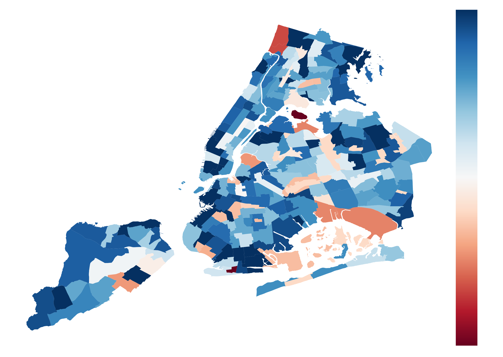
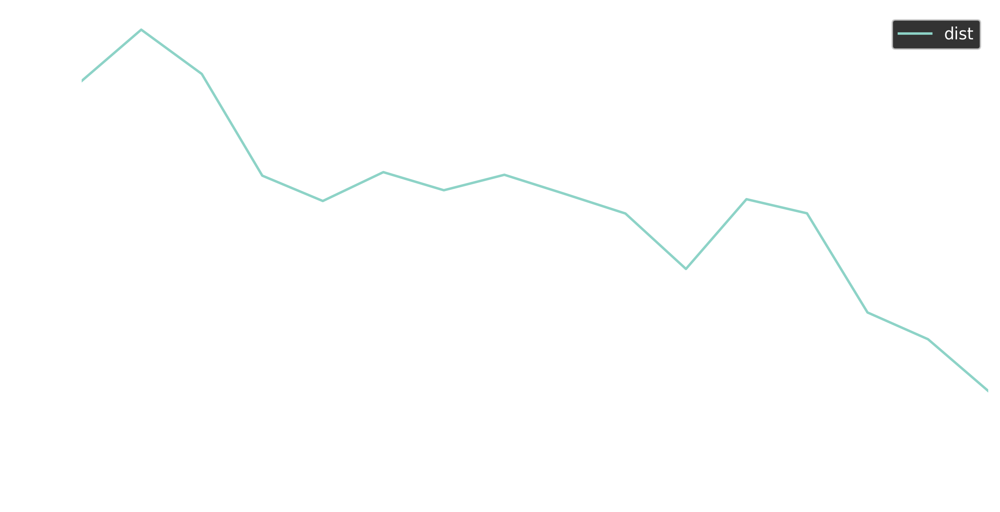

# Results mobility Unacast

*Authors:*

*Emanuele Massaro (1)*

*1. EPFL*

*Notice: this is preliminary analysis, has not yet been peer-reviewed and is updated daily as new data becomes available. This work is licensed under a Creative Commons Attribution 4.0 International License.*

## Data

Mobility data is provided by Unacast, a location intelligence, and measurement platform. This first-party data is collected from anonymized users who have opted-in to provide access to their location data anonymously, through a GDPR-compliant framework.

Location is collected anonymously from opted in users through smartphone applications. At the device level, iOS and Android operating systems combine various location data sources (e.g. GPS, wifi, beacons, network) and provide geographical coordinates with a given level of accuracy. Location accuracy is determined by the device and is variable, but can be as accurate as 10 meters.

Temporal sampling of anonymized users’ location is also variable and dependent on app/OS characteristics and on user behavioral patterns, but it has a high-frequency overall. We selected a panel of users who were active during the period 19 March - 03 April 2020. This leads to a sample of about 17Million users with a total of about 175 billion data points over the period of study. The basic unit of information we process is an event of the form (anonymous hashed user id, time, latitude, longitude), plus additional non-personal metadata and location accuracy.

## New York City

In the first process we analyzed the reduction of mobility in NYC. In the Figure we report the reduction of the traveling distance in each neighborhood.    

In the next figure we report the average distance per user per day in the entire City.  

In the same way we report the radius of gyration.
