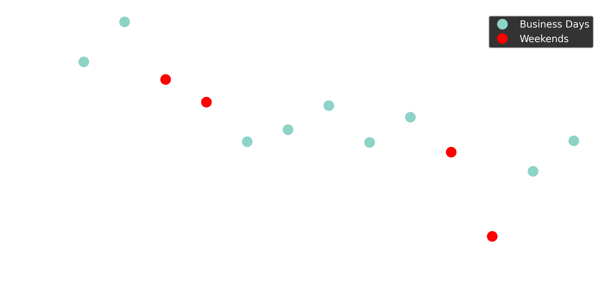

# US Mobility during the COVID outbreak

*Authors:*

**Emanuele Massaro (1)**

*1. EPFL*

*Notice: this is preliminary analysis, has not yet been peer-reviewed and is updated daily as new data becomes available. This work is licensed under a Creative Commons Attribution 4.0 International License.*     

## Data

Mobility data is provided by a location intelligence, and measurement platform. This first-party data is collected from anonymized users who have opted-in to provide access to their location data anonymously, through a GDPR-compliant framework.

Location is collected anonymously from opted in users through smartphone applications. At the device level, iOS and Android operating systems combine various location data sources (e.g. GPS, wifi, beacons, network) and provide geographical coordinates with a given level of accuracy. Location accuracy is determined by the device and is variable, but can be as accurate as 10 meters.

Temporal sampling of anonymized users’ location is also variable and dependent on app/OS characteristics and on user behavioral patterns, but it has a high-frequency overall. We selected a panel of users who were active during the period 19 March - 03 April 2020. This leads to a sample of about 17Million users with a total of about 175 billion data points over the period of study. The basic unit of information we process is an event of the form (anonymous hashed user id, time, latitude, longitude), plus additional non-personal metadata and location accuracy.  

## Methods

In the next plot we show the number of active users per day during the period of analysis.

Given the the fact that the dataset we analyze contains some infomration of users also of the previous days, we restrict our analysis in the period between March 19th - March 31st. 

In the analysis we considered only the records with an accuracy less than 100 meters. For each geographical units we count the average distance (in km) made by each user in a specific polygon and for each day we count the average of the distance made by the users in the specific geographic units. Given the accuracy of the data we also consider the users that made less than 300km per hour.
 

## County Level

In this section we show the reduction of mobility at county level in the US. There is a good correlation between active users and population as shown in the next Figure.

We count the difference in mobility between March 19th and March 31st.

In the map we can show a reduction of the mobility in most of the counties, while we can observe an increase of the daily mobility in some other counties.

In the next we report the average distance per day and the average radius of gyration per user per day with the difference between the business days and the weekends. 

However it could be interesting to see also the long range movements across the country. In doing so we infer the location of the users for each day.

## New York City

In the first process we analyzed the reduction of mobility in NYC. We analyze more than 9 billion data points and 1'375'515 distinct users. In the Figure we report the reduction of the traveling distance in each neighborhood.    

In the next figure we report the average distance per user per day in the entire City.  

In the same way we report the radius of gyration. 

We also study the correlation between the distance drop and the socio-economic status of the different district. We plot the correlation between houseld income and travel redduction at the community district level.

  
The plot indicates a positive correlation between travel reduction and houseld income.  

## Comparison among cities

We show the comparison in mobility among 5 different cities: New York, Boston, Chicago, Seattle, Los Angeles and San Francsico.

